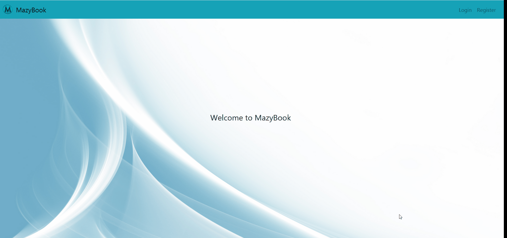

# Mazybook_social_media

A full-stack mobile responsive Social Media Application for registering new users and posting text and images, also commenting under the posts

## Technologies Used

1. Node.js (Express Framework)
2. React.js
3. HTML5
4. CSS3 (heavily used specially for mobile responsiveness)
5. Javascript
6. Bootstrap 4 (minimal use)
7. PostgreSQL
8. AWS EC2

## Features

- Users can get automatically redirected to homepage after registering (JWT for Authentication)
- Users have a profile page that will show their info such as the exact time the user as created
- Authenticated Users can view the homepage and post messages and images
- Authenticated Users can leave comments on their own or other users' posts

## Live Demo

Try the application live at [here](http://13.58.45.153)

## Preview

## Colaborator

Muzyar Rad aka. Mazy

## Setup Instructions

1. Install client dependencies

- on the project folder `cd` to `frontEnd`
- `npm install` or `npm i`

2. Install server dependencies

- `cd` to `/`
- `npm install` or `npm i`

3. Run the project

- `cd` to `/`
- npm run dev

4. Import the dump.sql file in your postgres Database and setup the database inside `/config/default.json` accordingly.

5. Open a browser and navigate to `localhost:3000`

6. Register with a new User to be able to add bugs for your project and see the full feature!

## Need Help?

Feel free to email me at **Muzyar.rad@gmail.com** for any inquiries or setup assistance
